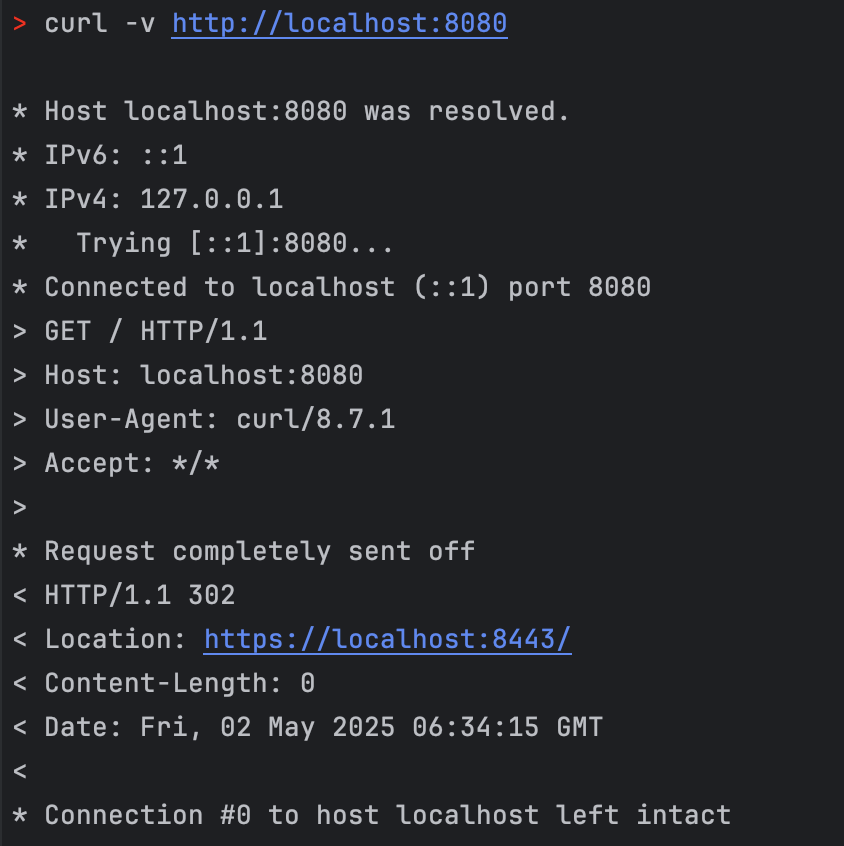

## HTTPS Setting
1. 자체 서명 인증서 생성
    - `keytool`로 PKCS12 형식의 `keystore.p12` 생성
2. application.properties HTTPS 설정

## HTTP → HTTPS 리다이렉트 흐름
1. 톰캣이 8080(HTTP)과 8443(HTTPS) 두 포트를 모두 오픈 
2. 클라이언트가 http://localhost:8080 으로 요청 
3. Spring Security 필터가 이 요청을 가로채 302 리다이렉트 응답 
   - 응답 헤더에 Location: https://localhost:8443 포함 
5. 클라이언트가 자동으로 HTTPS(8443)로 재접속하여 보안 연결로 서비스 이용

